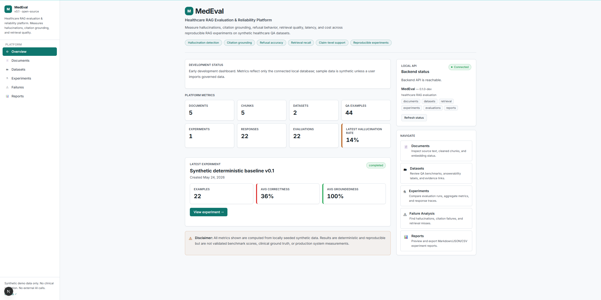
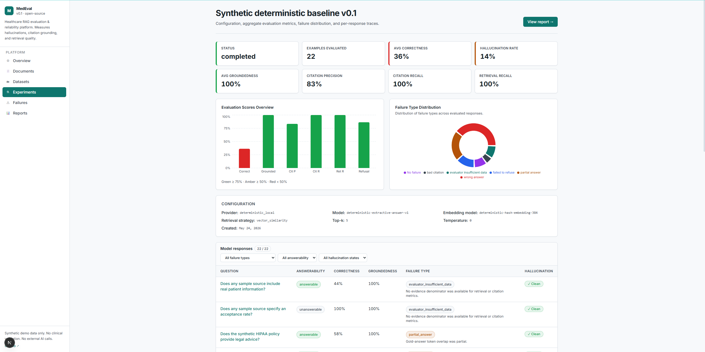
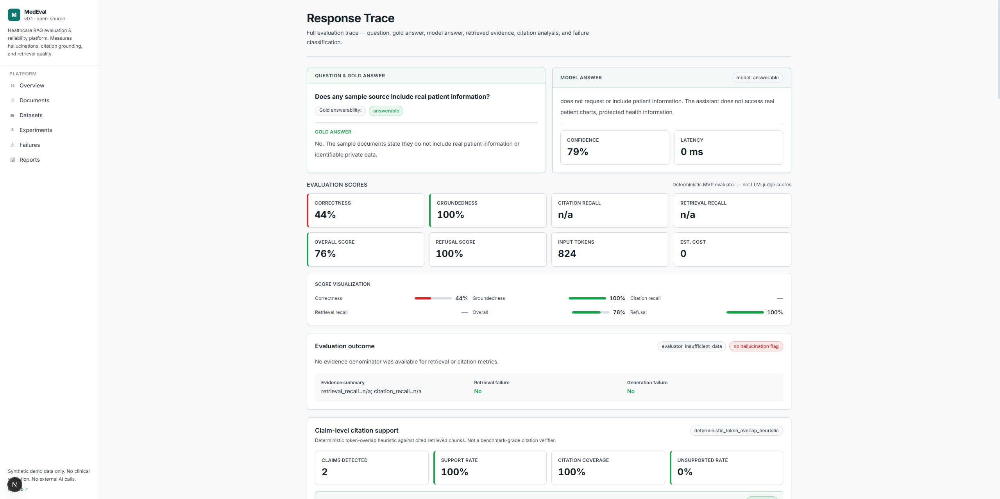
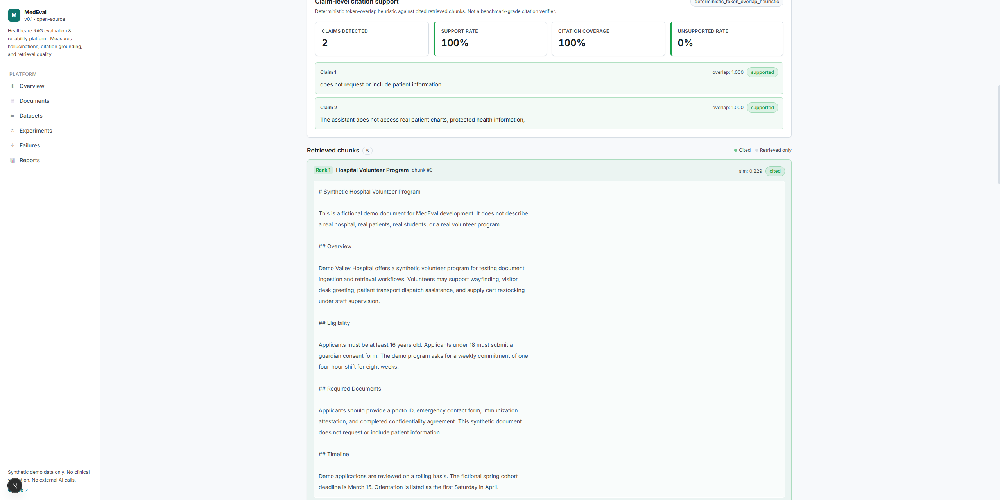
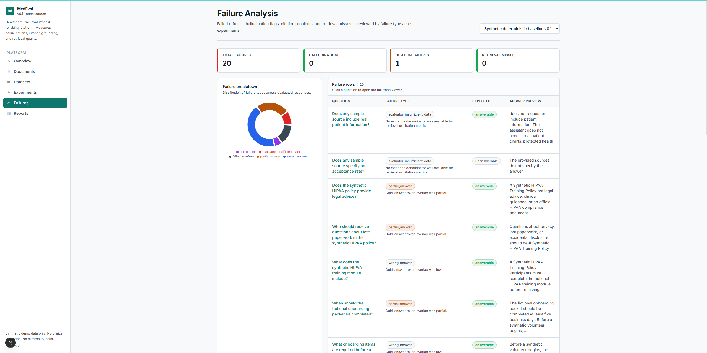
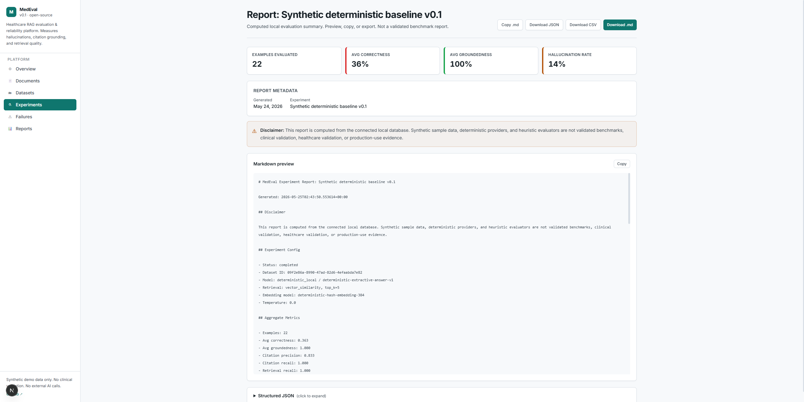
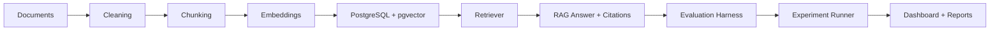

# MedEval

**Open-source healthcare RAG evaluation and reliability platform**

MedEval measures hallucinations, citation grounding, refusal behavior, retrieval
quality, latency, and cost across reproducible RAG experiments.

MedEval is not a chatbot. It is an evaluation harness and dashboard for testing
whether RAG/LLM systems answer with grounded citations, refuse unsupported
questions, and expose failure modes that engineers can inspect.


> Current status: early development with synthetic local demo data and an
> in-development MedEval v1 public healthcare seed dataset. This repository
> does not contain validated benchmark results, clinical validation, healthcare
> validation, production-use claims, or external adoption claims.

## Screenshots

All screenshots below use synthetic seeded local data.

| Overview Dashboard | Experiment Metrics |
| --- | --- |
|  |  |

| Trace Viewer | Claim Support And Evidence |
| --- | --- |
|  |  |

| Failure Analysis | Report Preview |
| --- | --- |
|  |  |

## Problem

RAG and LLM systems can answer confidently while being unsupported by the
retrieved evidence. In healthcare-adjacent workflows, that is not enough: users
need evidence-grounded answers, accurate citations, refusal behavior for
unsupported questions, and traceable failure modes.

The hard part is not only generating an answer. The hard part is evaluating
whether an answer is correct, grounded, cited, and safe to trust. MedEval focuses
on evaluation and reliability infrastructure rather than generic chatbot UX.

## Solution

MedEval provides a reproducible evaluation loop:

1. Ingest synthetic/demo or governed documents.
2. Clean and chunk source text while preserving evidence.
3. Generate deterministic local embeddings for development and tests.
4. Store vectors in PostgreSQL with pgvector.
5. Retrieve evidence chunks for QA examples.
6. Generate citation-grounded deterministic RAG traces.
7. Store retrieved chunks, cited chunks, model response metadata, and evaluator output.
8. Score correctness, groundedness, citations, refusals, retrieval, latency, and cost.
9. Inspect failures in a dashboard and trace viewer.
10. Export Markdown, JSON, and CSV reports.
11. Run reproducible experiments from YAML configs and a Typer CLI.

## Features

- Document ingestion, conservative text cleaning, and deterministic chunking
- Deterministic local embeddings for tests and demos without paid API keys
- PostgreSQL + pgvector vector storage and retrieval
- QA benchmark dataset import from JSONL
- Evidence-linked gold answers
- Citation-grounded RAG traces
- Deterministic local answer provider for development and demo workflows
- Correctness, groundedness, citation, retrieval, refusal, latency, and cost metrics
- Claim-level citation support heuristics
- Failure taxonomy for retrieval, citation, refusal, and generation issues
- Retrieval-vs-generation failure separation
- Human review records for response-level review workflows
- Human review dashboard for manual calibration against automated diagnostics
- YAML experiment configs
- Typer CLI for seeding, running experiments, and exporting reports
- Next.js dashboard
- Trace viewer with retrieved/cited chunks and evaluator metadata
- Failure analysis views
- Markdown, JSON, and CSV report exports

## Architecture



The backend is a FastAPI service with explicit modules for documents,
retrieval, datasets, RAG traces, evaluation, experiments, reports, and CLI
workflows. The database stores source documents, chunks, embeddings, QA
examples, evidence links, responses, evaluations, human reviews, and experiment
metadata. The frontend is a Next.js dashboard for exploring local experiment
state, not a chat interface.

More detail: [docs/architecture.md](docs/architecture.md).

## Metrics

MedEval currently tracks or computes:

- **Correctness**: heuristic overlap between answer text and gold answer for answerable examples.
- **Groundedness**: whether generated answers are supported by known retrieved/cited evidence.
- **Citation precision**: cited chunks that are required or acceptable evidence divided by total cited chunks.
- **Citation recall**: required evidence chunks cited divided by total required evidence chunks.
- **Retrieval precision**: retrieved chunks matching expected evidence divided by total retrieved chunks.
- **Retrieval recall**: required evidence chunks retrieved divided by total required evidence chunks.
- **Refusal accuracy**: whether unsupported or unanswerable questions are refused and answerable questions are not over-refused.
- **Hallucination rate**: fraction of responses flagged by deterministic unsupported-answer heuristics.
- **Claim support rate**: extracted answer claims marked supported or partially supported by citations.
- **Unsupported claim rate**: extracted claims marked unsupported or uncited.
- **Latency**: measured response-generation time in milliseconds where available.
- **Estimated cost**: provider-reported or deterministic placeholder cost where available.
- **Failure types**: retrieval misses, generation failures, bad citations, missing citations, failed refusals, over-refusals, unsupported claims, and related deterministic labels.

The current evaluator is deterministic and heuristic for local development and
sample evaluation. It is not a clinically validated evaluator and it is not a
final benchmark-grade judge.

## Demo Dataset

The checked-in demo dataset is **MedEval HealthcareQA Sample v0.1**. It contains
5 synthetic healthcare opportunity/onboarding documents and 22 synthetic QA
examples. The current QA file includes answerable and unanswerable questions
covering eligibility, deadlines, required documents, privacy/HIPAA training,
scheduling, location, application process, and role scope.

This dataset uses fake/demo content only:

- no real patient data
- no private student data
- no real organization claims
- no clinical review
- no benchmark or healthcare validation claim

It is intended for local demo, development, tests, and contributor onboarding.
See [docs/benchmark-card.md](docs/benchmark-card.md).

## MedEval v1 Public Healthcare Seed

The repository also includes an in-development MedEval v1 public healthcare
seed dataset with 25 public source documents and 230 evidence-linked QA
examples. Current deterministic local report artifacts are available under
`reports/`, including a baseline report and a four-config comparison with
heuristic rich failure diagnostics.

These artifacts use deterministic local providers only. They are not clinically
validated, not medical advice, not a completed benchmark, and not a real model
leaderboard.

Reproduce or check the MedEval v1 deterministic artifact loop with:

```bash
make medeval-v1-smoke
make medeval-v1-check-reports
```

See [docs/reproducibility.md](docs/reproducibility.md).

Manual review and calibration workflow documentation is available at
[docs/human_review.md](docs/human_review.md). Sample review fixtures are
workflow examples only, not real independent human review or clinical
validation.

## Quickstart

PowerShell on Windows:

```powershell
cd C:\Users\MOHIT\Projects\medeval
Copy-Item .env.example .env
docker compose up -d db
```

```powershell
cd backend
.\.venv\Scripts\python -m pip install -e ".[dev]"
.\.venv\Scripts\python -m alembic upgrade head
.\.venv\Scripts\medeval seed-docs --path ..\datasets\sample\documents
.\.venv\Scripts\medeval seed-qa --dataset-name "MedEval HealthcareQA Sample" --path ..\datasets\sample\qa\healthcare_qa_sample.jsonl
.\.venv\Scripts\medeval run-experiment --config ..\configs\experiments\baseline_deterministic.yaml
.\.venv\Scripts\python -m uvicorn app.main:app --reload --port 8000
```

In a second terminal:

```powershell
cd C:\Users\MOHIT\Projects\medeval\frontend
npm.cmd install
npm.cmd run dev
```

Open:

- Frontend dashboard: `http://localhost:3000`
- FastAPI docs: `http://localhost:8000/docs`

macOS/Linux equivalent:

```bash
cp .env.example .env
docker compose up -d db
cd backend
python -m pip install -e ".[dev]"
python -m alembic upgrade head
medeval seed-docs --path ../datasets/sample/documents
medeval seed-qa --dataset-name "MedEval HealthcareQA Sample" --path ../datasets/sample/qa/healthcare_qa_sample.jsonl
medeval run-experiment --config ../configs/experiments/baseline_deterministic.yaml
python -m uvicorn app.main:app --reload --port 8000
```

## CLI

Run commands from `backend/` after installing the backend package:

```powershell
.\.venv\Scripts\medeval status
.\.venv\Scripts\medeval seed-docs --path ..\datasets\sample\documents
.\.venv\Scripts\medeval seed-qa --dataset-name "MedEval HealthcareQA Sample" --path ..\datasets\sample\qa\healthcare_qa_sample.jsonl
.\.venv\Scripts\medeval run-experiment --config ..\configs\experiments\baseline_deterministic.yaml
.\.venv\Scripts\medeval export-report --experiment-id <experiment-id> --format markdown --out ..\reports\sample_deterministic_report.md
.\.venv\Scripts\medeval export-report --experiment-id <experiment-id> --format json --out ..\reports\sample_deterministic_report.json
.\.venv\Scripts\medeval export-results --experiment-id <experiment-id> --format csv --out ..\reports\sample_deterministic_results.csv
```

Generated reports are local artifacts unless intentionally checked in as clearly
labeled synthetic deterministic sample outputs.

## Dashboard Walkthrough

- **Overview**: backend status, counts, latest experiment summary, and navigation.
- **Documents**: source documents, metadata, chunks, token counts, and embedding status.
- **Datasets**: QA datasets, examples, answerability, difficulty, risk, and evidence links.
- **Experiments**: run configs, status, aggregate metrics, and response tables.
- **Trace Viewer**: question, gold answer, model answer, retrieved chunks, cited chunks, scores, claim support, failure metadata, and raw output.
- **Failure Analysis**: failure type counts, hallucination flags, failed refusals, retrieval misses, and links to traces.
- **Human Review**: manual review queue, response evidence, reviewer rubric form, and calibration summaries against automated diagnostics.
- **Reports**: Markdown/JSON report previews and CSV-friendly per-response exports.

## Report Exports

MedEval can export:

- Markdown experiment reports
- JSON report payloads
- CSV per-response result files

Reports are computed from the local database. Synthetic sample outputs should be
interpreted only as deterministic local demo artifacts, not validated benchmark
results.

## Repository Structure

```text
backend/              FastAPI backend, services, API routes, Alembic, tests
frontend/             Next.js TypeScript dashboard
datasets/             Synthetic sample documents and QA data
configs/              YAML experiment configs
docs/                 Architecture, metrics, benchmark, demo, and recruiting docs
reports/              Local report output destination
scripts/              Utility scripts
docker-compose.yml    Local PostgreSQL + pgvector
.env.example          Placeholder-only local configuration
```

## Testing

Backend:

```powershell
cd backend
.\.venv\Scripts\python -m pytest
.\.venv\Scripts\python -m ruff check .
.\.venv\Scripts\python -m alembic heads
```

Frontend:

```powershell
cd frontend
npm.cmd run typecheck
npm.cmd run build
```

## Limitations

- The deterministic answer provider is not a real LLM.
- The sample dataset is synthetic and intentionally small.
- The current evaluator is heuristic and deterministic.
- There is no clinical validation.
- There is no healthcare validation claim.
- There is no production deployment claim.
- There is no external user or adoption claim.
- Real OpenAI/Anthropic/provider integrations are future work.
- LLM-as-judge and deeper human-reviewed evaluation are future work.
- Larger benchmark scale and formal evaluation protocols are future work.

## Roadmap

- Real provider adapters for embeddings and answer generation
- Larger healthcare QA benchmark development
- Human and clinician review workflow expansion
- GuideLLM/Remi integration exploration
- Open-source benchmark report workflow
- Richer evaluator methods and calibration
- Deployment hardening
- CI/CD and release automation
- More robust retrieval and reranking experiments

## Why This Project Matters

MedEval demonstrates AI evaluation infrastructure across the full stack:
backend/data systems, RAG reliability, experiment tracking, failure analysis,
reproducible reports, and dashboarding. It is designed with healthcare-adjacent
safety concerns in mind while staying honest about its current limits: synthetic
sample data, deterministic local providers, and heuristic evaluation only.

## Safety And Privacy

Do not commit secrets, real patient data, private student data, or local `.env`
files. Use synthetic/demo data only unless a future governed workflow explicitly
defines safe handling requirements.

## License

MIT. See [LICENSE](LICENSE).
