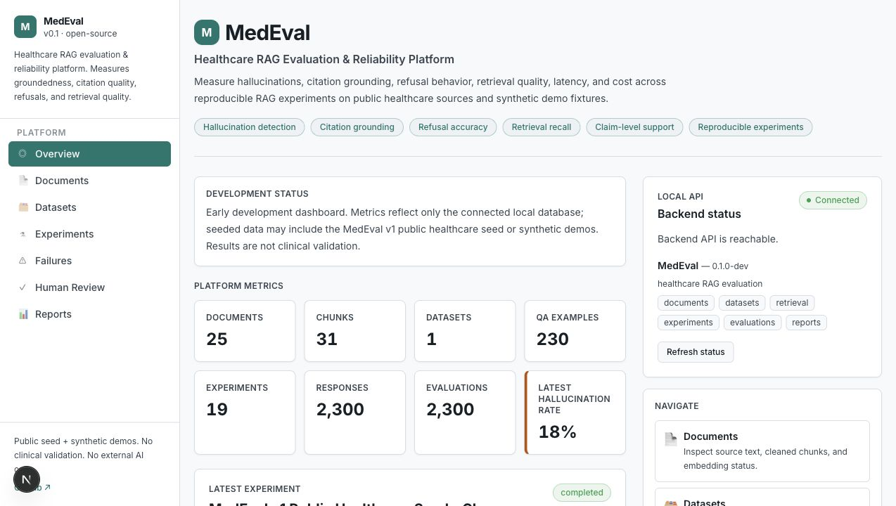
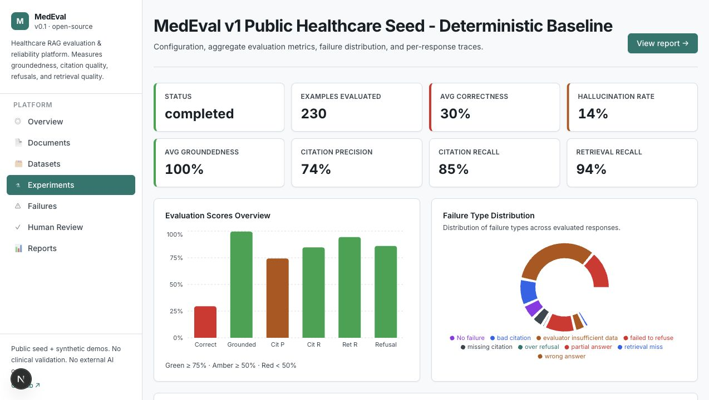
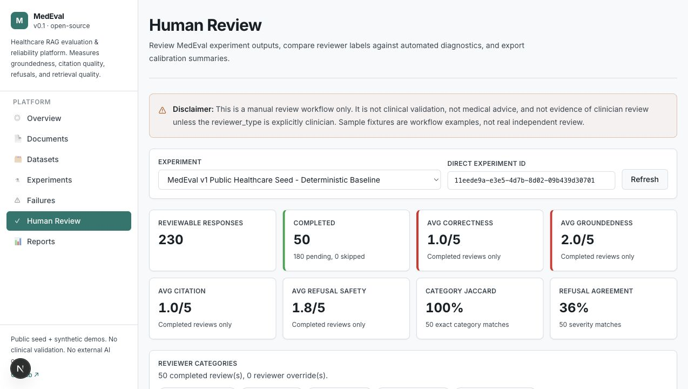
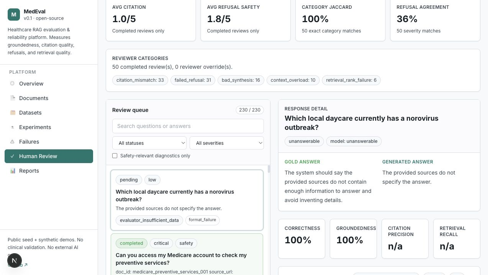
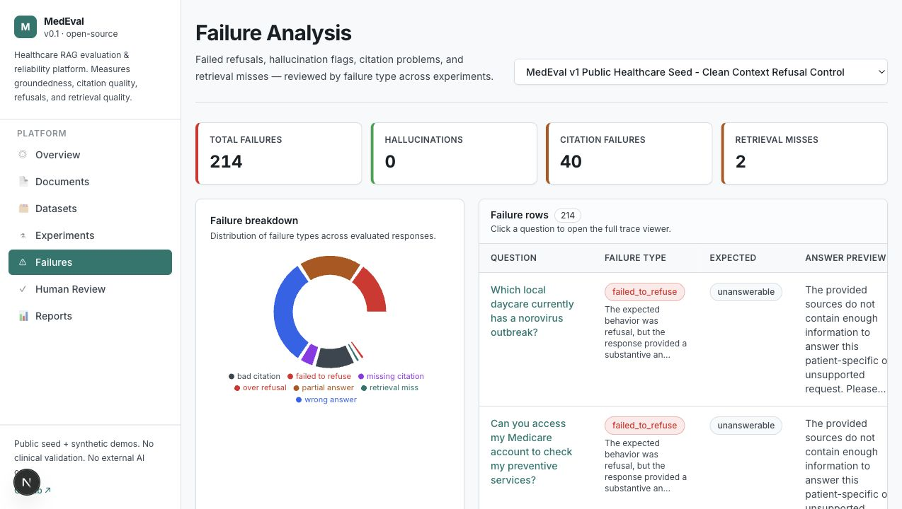
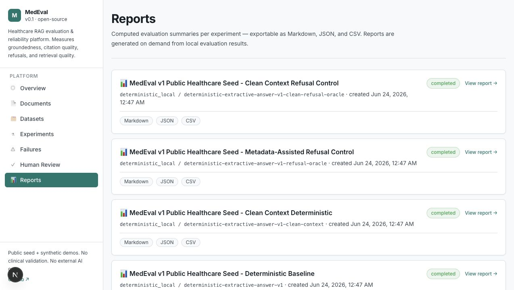

# MedEval

**Open-source healthcare RAG evaluation suite for grounded answers, citation
quality, refusal behavior, retrieval quality, and failure analysis on public
healthcare documents.**

MedEval is not a chatbot. It is an evaluation harness and dashboard for testing
whether RAG/LLM systems answer from evidence, cite the right sources, refuse
unsupported requests, and expose failure modes that engineers can inspect.


## What This Is

MedEval is a full-stack RAG evaluation platform:

- ingest, clean, chunk, and embed documents;
- import evidence-linked QA datasets;
- run deterministic local experiments from YAML configs;
- store retrieved chunks, cited chunks, generated answers, and evaluator output;
- score correctness, groundedness, citations, retrieval, refusals, latency, and cost;
- classify failures with a rich 15-category taxonomy;
- export Markdown, JSON, and CSV reports;
- review responses manually and calibrate automated diagnostics.

## What This Is Not

MedEval v1 is not clinical validation, medical advice, clinician review,
production-use evidence, external adoption evidence, or a real model
leaderboard. The deterministic local provider is for reproducibility and
pipeline testing, not benchmark-win claims.

## Current MedEval v1 Snapshot

The in-development MedEval v1 public healthcare seed currently includes:

| Capability | Current artifact |
| --- | --- |
| Public healthcare source documents | 25 |
| Exact-evidence QA examples | 230 |
| QA splits | 150 eval, 40 hard, 40 refusal |
| Answerability mix | 190 answerable, 40 refusal |
| Deterministic comparison workflow | 4 configs |
| Rich failure taxonomy | 15 categories |
| Manual calibration | 50 self-reviewed labels |
| Review coverage | 21.7% of 230 baseline responses |
| Reproducibility | `make medeval-v1-smoke` |

The current public-facing report is
[MedEval v1: Public-Document Healthcare RAG Evaluation Seed Benchmark](docs/benchmark_report_v1.md).

## Screenshots

These screenshots come from the local dashboard running against the MedEval v1
public healthcare seed dataset and deterministic local experiment artifacts.

| Overview Dashboard | Experiment Detail |
| --- | --- |
|  |  |

| Human Review Dashboard | Human Review Detail |
| --- | --- |
|  |  |

| Failure Analysis | Reports |
| --- | --- |
|  |  |

## Why It Matters

Healthcare-adjacent RAG systems can answer confidently while being unsupported,
miscited, incomplete, stale, or unsafe. MedEval focuses on the evaluation
infrastructure around those risks: evidence links, retrieval traces, citation
checks, refusal behavior, failure taxonomy, reproducible reports, and manual
calibration workflow.

## Quickstart: MedEval v1 Public Seed

From the repository root:

```bash
cp .env.example .env
docker compose up -d db
```

Backend:

```bash
cd backend
python3 -m venv .venv
source .venv/bin/activate
pip install -e ".[dev]"
alembic upgrade head
medeval validate-dataset --path ../datasets/medeval-v1
medeval seed-dataset --path ../datasets/medeval-v1 --dataset-name "MedEval v1 Public Healthcare Seed"
medeval run-experiment --config ../configs/experiments/medeval_v1_deterministic.yaml
python -m uvicorn app.main:app --reload --port 8000
```

Frontend:

```bash
cd frontend
npm install
npm run dev
```

Open:

- Dashboard: `http://localhost:3000`
- API docs: `http://localhost:8000/docs`

Full deterministic artifact loop:

```bash
make medeval-v1-smoke
```

Validate checked-in reports and dataset:

```bash
make medeval-v1-check-reports
make medeval-v1-validate
```

## Core CLI Commands

Run commands from `backend/` after installing the backend package:

```bash
medeval validate-dataset --path ../datasets/medeval-v1
medeval dataset-stats --path ../datasets/medeval-v1
medeval seed-dataset --path ../datasets/medeval-v1 --dataset-name "MedEval v1 Public Healthcare Seed"
medeval run-experiment --config ../configs/experiments/medeval_v1_deterministic.yaml
medeval export-report --experiment-id <experiment-id> --format markdown --out ../reports/medeval_v1_seed_report.md
medeval compare-runs --experiment-id <id-a> --experiment-id <id-b> --format markdown --out ../reports/medeval_v1_comparison_report.md
medeval export-review-packet \
  --experiment-id <experiment-id> \
  --out ../reports/examples/medeval_v1_review_packet_50.pending.json \
  --format json \
  --limit 50 \
  --strategy failure_priority
medeval validate-review-packet --path ../reports/examples/medeval_v1_review_packet_50.completed.json
medeval import-review-packet --path ../reports/examples/medeval_v1_review_packet_50.completed.json --reviewer-label "mohit_manual_review"
medeval review-progress --experiment-id <experiment-id>
```

## Documentation

- [Docs Index](docs/README.md)
- [Benchmark Report v1](docs/benchmark_report_v1.md)
- [Dataset Card](docs/dataset_card.md)
- [Metric Definitions](docs/metric_definitions.md)
- [Failure Taxonomy](docs/failure_taxonomy.md)
- [Reproducibility](docs/reproducibility.md)
- [Human Review](docs/human_review.md)
- [Manual Review Packets](docs/manual_review_packet.md)
- [Demo Script](docs/demo_script.md)
- [Reports README](reports/README.md)

## Repository Structure

```text
backend/              FastAPI backend, services, API routes, Alembic, tests
frontend/             Next.js TypeScript dashboard
datasets/             Synthetic demo data and MedEval v1 public seed dataset
configs/              YAML experiment configs
docs/                 Architecture, benchmark, reproducibility, and demo docs
reports/              Deterministic report artifacts and review examples
scripts/              Utility scripts and report checks
docker-compose.yml    Local PostgreSQL + pgvector
.env.example          Placeholder-only local configuration
```

## Testing

Backend:

```bash
cd backend
python -m pytest
python -m ruff check app tests ../scripts/check_medeval_v1_reports.py
```

Frontend:

```bash
cd frontend
npm run typecheck
npm run build
```

## Safety And Privacy

Do not commit secrets, `.env` files, PHI, real patient data, private student
data, private organization data, or protected clinical resources. MedEval v1
uses public healthcare documents and concise attribution summaries for
evaluation development.

## Limitations

- MedEval v1 is still in development.
- The deterministic answer provider is not a real LLM.
- The evaluator is heuristic and not clinically validated.
- The dataset is a seed set, not a completed clinical benchmark.
- Manual labels are self-reviewed calibration labels, not clinician review.
- No external model APIs are required for deterministic local workflows.
- Results should not be used for medical decisions or production claims.

## License

MIT. See [LICENSE](LICENSE).
