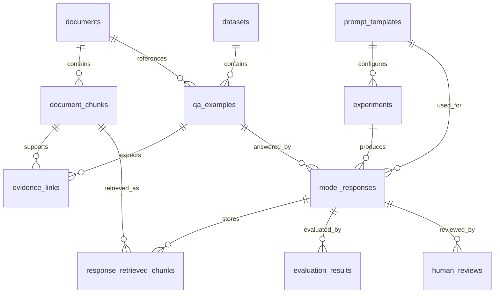
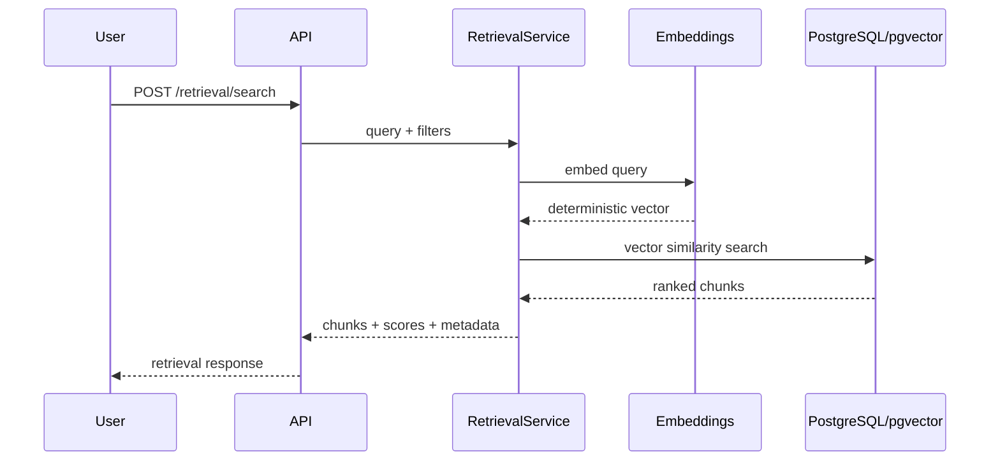
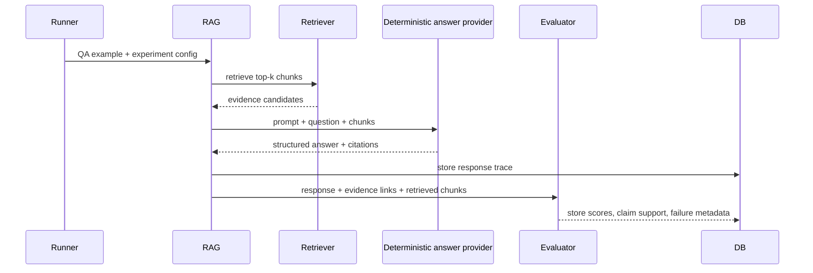
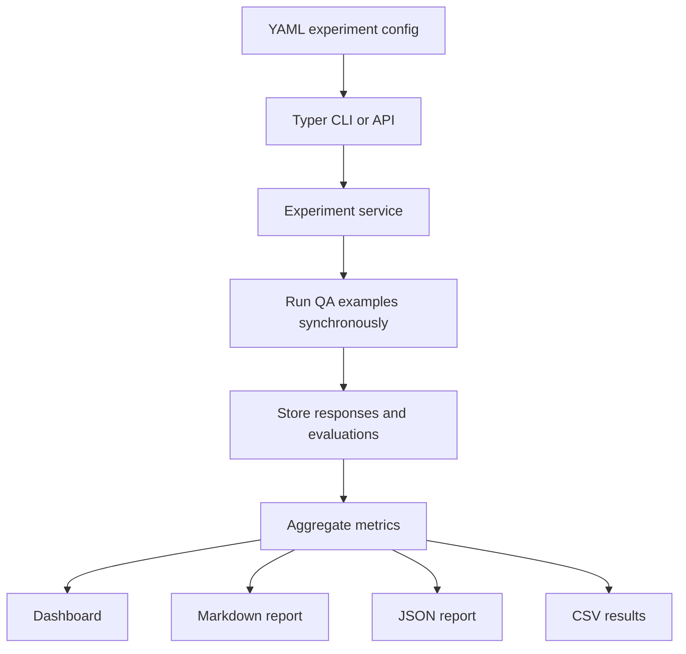
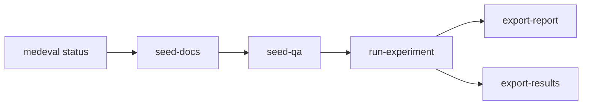

# Architecture

MedEval is a modular evaluation platform for healthcare-adjacent RAG and LLM
systems. It is built to inspect reliability, evidence grounding, citation
behavior, retrieval quality, refusals, traces, and reports. It is not a chatbot
and it does not claim clinical validation.

## High-Level Flow

```mermaid
flowchart LR
  A["Synthetic or governed documents"] --> B["Text cleaning"]
  B --> C["Deterministic chunking"]
  C --> D["Embedding provider"]
  D --> E["PostgreSQL + pgvector"]
  E --> F["Retriever"]
  F --> G["RAG answer provider"]
  G --> H["Model response trace"]
  H --> I["Evaluation harness"]
  I --> J["Experiment results"]
  J --> K["Dashboard + reports"]
```

## Backend Service Layers

- **API layer**: FastAPI routes under `/api/v1` for documents, retrieval,
  datasets, QA examples, prompts, RAG answers, responses, evaluations,
  experiments, reports, dashboard summary, and human reviews.
- **Schema layer**: Pydantic request/response models keep API shapes explicit.
- **Service layer**: ingestion, text cleaning, chunking, embeddings, retrieval,
  datasets, prompt rendering, deterministic answer generation, RAG traces,
  evaluation, experiment execution, reporting, config loading, and CLI support.
- **Evaluation layer**: deterministic correctness, grounding, citation,
  retrieval, refusal, hallucination, failure taxonomy, and claim-support
  heuristics.
- **Persistence layer**: SQLAlchemy models and Alembic migrations for
  PostgreSQL/pgvector, with isolated SQLite test fallbacks where needed.

## Database Entities

Core tables include documents, document chunks, retrieval logs, datasets, QA
examples, evidence links, prompt templates, experiments, model responses,
response retrieved chunks, evaluation results, and human reviews.

## Retrieval Flow

The default development embedding provider is deterministic and local. It is
useful for tests and sample demos, but it is not a semantic embedding model for
real evaluation.

## RAG And Evaluation Flow

The deterministic answer provider never uses the gold answer to generate a
response. It exists so developers can run the full loop without paid APIs or
external services.

## Experiment And Report Flow

Experiments are synchronous and small-dataset oriented today. Reports are
computed from the local database and include limitations/disclaimers.

## Frontend Dashboard Flow

The Next.js dashboard uses a typed fetch client pointed at
`NEXT_PUBLIC_API_BASE_URL`, defaulting to `http://localhost:8000/api/v1`.
Dashboard pages read backend state directly:

- overview summary counts
- documents and chunks
- datasets, QA examples, and evidence links
- experiments and aggregate metrics
- response traces with retrieved/cited chunks
- claim support and failure metadata
- report previews and downloads

Empty states explain how to seed sample data instead of hardcoding fake metrics.

## CLI Flow

The Typer CLI wraps repeatable local demo workflows:

CLI commands respect the configured `DATABASE_URL`, do not require API keys, and
are intended for synthetic local demo runs unless a future governed data process
is added.

## Boundaries

- No real patient data is included.
- No private student data is included.
- No real provider APIs are called by tests or local deterministic workflows.
- Current metrics are heuristic and not clinically validated.
- Synthetic sample outputs are not benchmark results.
